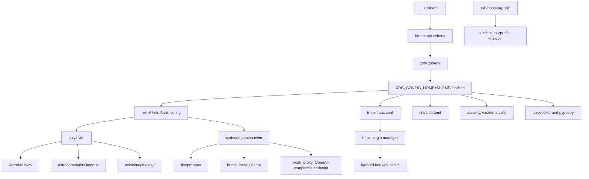

# Project Overview

This repository is an XDG-oriented macOS dotfiles workspace for terminal, shell, editor,
and developer tooling configuration. It centralizes Neovim/AstroNvim setup, reusable AI
prompt workflows, tmux, Starship, Zsh bootstrap files, terminal emulator configs, package
bootstrap lists, and selected CLI tool settings so one laptop can reproduce a consistent
interactive development environment.

## Repository Structure

- `alacritty/` - Alacritty terminal configuration, key bindings, color script, and themes.
- `bootstrap/` - Stow package for home-level bootstrap files that redirect shell startup
  into repo config.
- `lazydocker/` - lazydocker configuration.
- `llm/` - Global AI prompt library and prompt-system policy used by Neovim.
- `mac-setup/` - Homebrew `Brewfile` for macOS package bootstrap.
- `nvim/` - AstroNvim user configuration, plugin specs, Lua helpers, and lockfile.
- `pypoetry/` - Poetry configuration.
- `tmux/` - tmux configuration; plugin checkouts are intentionally ignored.
- `wezterm/` - WezTerm configuration.
- `zellij/` - Zellij configuration.
- `zsh/` - Tracked Zsh startup files and bootstrap script.
- `.gitignore` - Ignore rules for machine state, plugin caches, and local-only tools.
- `README.md` - Manual macOS setup notes and installation checklist.
- `starship.toml` - Starship prompt configuration loaded through `STARSHIP_CONFIG`.

## Build & Development Commands

There is no root package manifest, task runner, CI file, or documented test suite. Use
tool-native commands and keep missing workflows behind TODOs.

Install or bootstrap:

```sh
# Install Homebrew packages, applications, and fonts declared by the repo.
brew bundle --file mac-setup/Brewfile

# Create ~/.zshenv as a symlink to bootstrap/.zshenv.
stow --target "$HOME" bootstrap

# Link tracked Zsh startup files and install Oh My Zsh if missing.
zsh zsh/bootstrap.zsh

# Neovim bootstraps lazy.nvim on first start.
nvim

# tmux/tmux.conf bootstraps TPM if ~/.dotfiles/tmux/plugins/tpm is missing.
tmux source-file ~/.dotfiles/tmux/tmux.conf
```

Test:

```sh
# TODO: Add first-party automated tests for Lua helpers and shell startup behavior.
```

Lint:

```sh
stylua --check nvim
selene nvim
zsh -n bootstrap/.zshenv zsh/.zshenv zsh/.zprofile zsh/.zshrc zsh/bootstrap.zsh
```

Type-check:

```sh
# TODO: Add a documented type-check command for first-party Lua.
```

Run:

```sh
nvim
tmux source-file ~/.dotfiles/tmux/tmux.conf
zellij --config-dir ~/.dotfiles/zellij
```

Debug:

```sh
nvim --headless "+checkhealth" +qa
NVIM_AI_PROFILE=work nvim
```

Deploy:

```sh
# TODO: Document deployment/bootstrap for a new host beyond README.md notes.
```

## Code Style & Conventions

- Format first-party Lua with `stylua`; `nvim/.stylua.toml` sets Unix line endings,
  two-space indentation, `column_width = 120`, `quote_style = "AutoPreferDouble"`,
  `call_parentheses = "None"`, and `collapse_simple_statement = "Always"`.
- Lint Neovim Lua with `selene nvim`; `nvim/selene.toml` uses `std = "neovim"` and
  allows selected rules for this config style.
- Keep `nvim/lua/community.lua` imports enabled-only, alphabetized within sections, and
  ordered as foundation/UI, language packs, editing/search, git/docker, LSP/debugging,
  then workflow/motion.
- Keep plugin specs under `nvim/lua/plugins/` grouped by domain: `ai`, `debugging`,
  `editing`, `ui`, and top-level shared specs.
- Keep reusable prompts in `llm/prompts/` as Markdown files with metadata/frontmatter.
  Use short kebab-case names and one stable logical purpose per prompt.
- Keep project-specific prompts outside this repo in `<repo>/.prompts` unless the prompt
  is reusable across projects.
- Do not mix prompt text, repo rules, backend adapter config, and secrets in one file.
- Commit messages follow Conventional Commits:
  `<type>(<optional scope>): <subject>`, lowercase type and scope, imperative subject,
  and no trailing period.

## Architecture Notes



The shell layer starts from `$HOME/.zshenv`, which is managed by Stow as a symlink to
`bootstrap/.zshenv`. That bootstrap file sets `ZDOTDIR=$HOME/.dotfiles/zsh` and sources
the repo-managed `zsh/.zshenv`; the repo-managed shell layer then sets XDG paths so
application configs resolve from `~/.dotfiles`. Neovim loads `lazy_setup.lua`, which
imports AstroNvim, AstroCommunity packs, and local plugin specs. CodeCompanion reads
reusable prompt Markdown from `llm/prompts` and selects either the local Ollama adapter or
a work proxy adapter from environment variables. tmux uses `tmux.conf` as the source of
truth and bootstraps TPM when the plugin manager is missing. `zsh/bootstrap.zsh` links
startup files into `$HOME` and installs Oh My Zsh into an ignored local checkout when
needed.

## Testing Strategy

- Unit tests: no first-party unit test suite is documented.
  > TODO: Add tests for `nvim/lua/config/ai/docstring/extractor.lua` if its behavior
  > becomes shared or regression-prone.
- Integration checks: run `stylua --check nvim`, `selene nvim`, `zsh -n ...`, and
  `nvim --headless "+checkhealth" +qa` before broad config changes.
- Neovim plugin checks: start `nvim` after editing plugin specs so Lazy can surface
  install, dependency, or lockfile issues.
- tmux checks: run `tmux source-file ~/.dotfiles/tmux/tmux.conf` after tmux changes.
- E2E tests: no automated end-to-end workflow is documented.
  > TODO: Document a manual smoke test for a fresh shell, tmux session, and Neovim launch.
- CI: no CI configuration is present.
  > TODO: Add CI or document why validation remains local-only.

## Security & Compliance

- Do not commit secrets, API keys, tokens, proxy credentials, or machine-specific paths
  beyond the explicit dotfiles contract.
- CodeCompanion work mode requires `NVIM_AI_WORK_URL`, `NVIM_AI_WORK_API_KEY`, and
  `NVIM_AI_WORK_MODEL`. Optional variables are `NVIM_AI_WORK_CHAT_URL`,
  `NVIM_AI_WORK_PROXY`, `NVIM_AI_WORK_ALLOW_INSECURE`, `NVIM_AI_PROFILE`, and
  `NVIM_AI_OLLAMA_MODEL`.
- Treat `.pyenv/`, `tmux/plugins/*`, ignored Zsh plugin checkouts, shell history, htop
  config, and local-only CLI configs as machine state unless the user explicitly asks to
  version them.
- `nvim/lazy-lock.json` pins Neovim plugin revisions; update it only through plugin update
  workflows, not hand edits.
- Vendored upstream plugin directories may carry their own licenses, but they are ignored
  by this repository. This repository has no root license file.
  > TODO: Add or document the first-party repository license.
- Dependency scanning is not configured.
  > TODO: Add a documented check for Neovim plugins, tmux plugins, and shell plugins.

## Agent Guardrails

- Never edit ignored machine state such as `.pyenv/`, `tmux/plugins/*`, shell history, or
  local-only tool configs unless the user explicitly requests it.
- Do not hand-edit vendored upstream plugin internals; change plugin declarations or the
  documented update flow instead.
- Do not rewrite `nvim/lazy-lock.json` unless the task is a plugin update or lockfile
  refresh.
- Be cautious with `nvim/init.lua`; it is a bootstrap file and its own comment says it
  should not usually be touched.
- Changes to `llm/PROMPT_POLICY.md`, CodeCompanion profile selection, shell bootstrap or
  startup files, and tmux bootstrap behavior require focused review because they affect
  every session.
- Prompt workflows that modify code must use a reviewable surface by default; the prompt
  policy explicitly forbids automatic application of destructive output.
- Do not run network-heavy plugin updates, work-proxy AI calls, or broad recursive scans of
  ignored plugin checkouts without user approval.
- Do not run `git add`, `git commit`, `git push`, `git rebase`, `git reset`, or amend
  commits unless explicitly asked.

## Git Commits

- Use Conventional Commits for every commit message:
  `<type>(<scope>): <description>`.
- Keep the description short, imperative, and lowercase unless a proper noun
  requires capitalization.
- Choose the narrowest useful scope, usually the top-level area changed:
  `nvim`, `zsh`, `tmux`, `docs`, or another directory/config name.
- Prefer these commit types:
  - `feat`: user-facing feature or new capability.
  - `fix`: bug fix or broken behavior.
  - `chore`: maintenance, dependency, config, or tooling changes.
  - `docs`: documentation-only changes.
  - `refactor`: behavior-preserving code restructuring.
  - `test`: tests only.
- Before committing, inspect `git status --short` and `git diff --cached`.
- Stage only files that belong to the requested change. Do not include unrelated
  user work in the commit.
- Use a body only when the subject cannot explain the change clearly enough.

Examples:

```text
chore(zsh): remove zshenv loading echo
docs(agents): add git commit rules
fix(nvim): correct treesitter ensure_installed in astrocore
```

## Progress Updates

- After each meaningful action, post a short summary in chat of what was done.
- Keep those summaries concise and factual.
- Do not paste large `git diff`, full command output, or long logs in chat unless the user explicitly asks for them.
- When a diff is useful, provide a short version with the files changed and the practical effect.
- Treat command output as token-expensive. Prefer narrow commands and bounded output.
- For status reporting, summarize the relevant result instead of relaying raw logs.

## Output Limits

- Avoid commands that can emit very large output unless the task explicitly requires them.
- Prefer `git diff --stat`, `git diff --name-only`, or a diff scoped to specific files over full repository diffs.
- Prefer `rg -n <pattern> <specific-path>` over searching large dependency trees.
- When searching external dependency directories such as plugin caches, narrow the path to the package or file likely to contain the answer.
- Use command output limits where available and keep them small by default.

## Extensibility Hooks

- Add reusable AI workflows as Markdown prompts in `llm/prompts/`; project overrides live
  in `<repo>/.prompts`.
- Add or adjust CodeCompanion profiles in `nvim/lua/config/ai/codecompanion_profiles.lua`.
- Add Neovim plugin specs through `nvim/lua/plugins/init.lua` and domain folders below
  `nvim/lua/plugins/`.
- Extend language tooling through `nvim/lua/plugins/mason.lua`, language packs through
  `astrocommunity.pack.*` imports in `nvim/lua/community.lua`, and Treesitter parser
  coverage through `opts.treesitter.ensure_installed` in `nvim/lua/plugins/astrocore.lua`.
- Add AstroCommunity imports in `nvim/lua/community.lua` while preserving its section order.
- Add tmux plugins with `set -g @plugin` entries in `tmux/tmux.conf`.
- Add Stow-managed home-level Zsh entrypoint behavior in `bootstrap/.zshenv`.
- Add Homebrew package bootstrap entries in `mac-setup/Brewfile`.
- Add Zsh symlink/install behavior in `zsh/bootstrap.zsh` and startup behavior in tracked
  Zsh startup files.
- Add prompt modules or display modules in `starship.toml`.
- Add terminal-specific behavior in `alacritty/`, `wezterm/`, or `zellij/`.
- Environment variables are the main feature flags: XDG paths in `zsh/.zshenv`, AI profile
  variables in CodeCompanion config, and tool-specific paths for Zellij and WezTerm.

## Further Reading

- [README.md](README.md)
- [bootstrap/.zshenv](bootstrap/.zshenv)
- [llm/README.md](llm/README.md)
- [llm/PROMPT_POLICY.md](llm/PROMPT_POLICY.md)
- [mac-setup/Brewfile](mac-setup/Brewfile)
- [nvim/README.md](nvim/README.md)
- [nvim/lua/config/ai/codecompanion_profiles.lua](nvim/lua/config/ai/codecompanion_profiles.lua)
- [nvim/lua/plugins/mason.lua](nvim/lua/plugins/mason.lua)
- [tmux/tmux.conf](tmux/tmux.conf)
- [zsh/.zshenv](zsh/.zshenv)
- [zsh/.zshrc](zsh/.zshrc)
- [zsh/bootstrap.zsh](zsh/bootstrap.zsh)

> TODO: Add deeper architecture docs such as `docs/ARCH.md` or ADRs when they exist.
