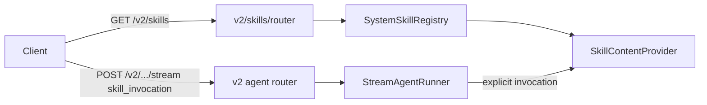

# MR Authoring — детальные правила

Контракт оформления для skill `gitlab-mr-author`. Читай этот файл, когда нужно: выбрать `type`/`scope`, сопоставить пункты чеклиста с фактами diff, разделить свой scope и pre-existing drift, либо взять fallback-структуру при отсутствии шаблона в репозитории.

## Содержание

1. Выбор `type` для заголовка
2. Выбор `scope` для заголовка
3. Правила описания заголовка
4. Сопоставление чеклиста с фактами diff
5. Блок «На что обратить внимание»
6. Разделение своего scope и pre-existing drift
7. Fallback-структура описания
8. Worked example
9. Большие и API-затрагивающие MR: mermaid + API

## 1. Выбор `type` для заголовка

Тип выбирается по **главному смыслу diff**, а не по второстепенным файлам. Если в diff есть и новая функциональность, и сопутствующие тесты — тип определяет функциональность (`feat`), а не тесты.

| type       | Когда                                                                 |
| ---------- | --------------------------------------------------------------------- |
| `feat`     | Новое наблюдаемое поведение, возможность, эндпоинт, capability/skill   |
| `fix`      | Исправление дефекта в существующем поведении                          |
| `refactor` | Изменение структуры кода без изменения наблюдаемого поведения          |
| `perf`     | Изменение ради производительности                                     |
| `test`     | Только тесты (без изменения продакшн-поведения)                        |
| `docs`     | Только документация                                                   |
| `style`    | Форматирование, без смысловых изменений                              |
| `build`    | Сборка, зависимости, упаковка                                        |
| `ci`       | CI/CD конфигурация и пайплайны                                       |
| `chore`    | Служебные изменения без продакшн-эффекта                              |

Если изменения смешанные и ни один смысл не доминирует — выбери тип по тому, что несёт основную ценность ревью. Не сочиняй составные типы.

## 2. Выбор `scope` для заголовка

`scope` — короткая область из путей затронутых файлов, узнаваемая в этом репозитории. Бери её из верхних уровней путей и устоявшихся имён подсистем, например:

* `scripts/agent_eval/**`, `tests/agent_eval/**` → `agent-eval`;
* `capabilities/**` → `capabilities`；
* `skills/**` → `skills` или конкретный id скилла;
* `src/app/infrastructure/mcp/**` → `mcp`;
* метрики/телеметрия → `metrics`;
* `migrations/**` → `migrations`;
* presentation/HTTP слой → `api` или `presentation`.

Если изменения затрагивают несколько областей и одна явно главная — бери её. Если общей области нет — опусти `scope`: `type: описание` тоже валидно. Не выдумывай `scope`, которого нет в путях.

## 3. Правила описания заголовка

* Язык — русский, нижний регистр, без точки в конце.
* Императив/факт изменения: «добавил…», «поправил…», «вынес…» либо безличное «добавлен…». Следуй стилю недавних коммитов ветки (`git log --oneline`), если он единообразен.
* Длина — короткая строка, передающая суть.
* Технические идентификаторы (имена классов, функций, файлов, API, env, флагов) — as-is, без перевода и без русских окончаний через дефис.

## 4. Сопоставление чеклиста с фактами diff

Отмечай `[x]` только проверяемое по факту. Для типового чеклиста репозитория:

* **«Заголовок MR соответствует формату `type(scope): …`»** — `[x]`, если сформированный заголовок реально соответствует формату.
* **«Локальные проверки пройдены: `just project-check`»** — `[x]` только если `project-check` отработал и прошёл. Если упал или не запускался — `[ ]`, а в резюме объясни статус. Не помечай авансом.
* **«Если менял конфиги / деплой / интеграции — приложил детали ниже»** — `[x]`, если такие изменения есть в diff и детали действительно описаны ниже; если таких изменений нет — пункт неприменим, отметь это явно.

Принцип: галочка — это утверждение о факте. Ложная галочка хуже честного `[ ]` с пояснением.

## 5. Блок «На что обратить внимание»

Отмечай только пункты, реально присутствующие в diff. Признаки по diff:

* **Менялся API-контракт** — правки в presentation/HTTP слое, схемах запроса/ответа, публичных контрактах, `.data_contracts/**`, OpenAPI.
* **Менялись конфиги / env / secrets** — `configs/**`, `.env*`, новые `DATA_AGENT_*` переменные, TOML-секции.
* **Менялась CI/CD логика** — `.gitlab/**` (кроме шаблонов MR), `.devplatform/**`, пайплайны, `deploy/**`.
* **Менялись сборка / dev-tooling** — `Makefile`, `justfile`, `pyproject.toml`, `uv.lock`, `ruff.toml`, `mypy.ini`, конфигурация `pre-commit`, `deptry`. Это редко «фича», но почти всегда заметно ревьюеру: новые цели, исключения линтера, изменения зависимостей. Отметь такие изменения (обычно под «конфиги», иногда под «CI/CD») и **явно различай dev-only и prod**: например, новые `eval-*` цели в `Makefile` или `extend_exclude` для developer-инструментария — это dev-tooling, а не production runtime/CI. Не прячь такие изменения за «Нет особенностей».
* **Есть миграция БД** — новые файлы в `migrations/**`, изменения Alembic.
* **Нужны post-deploy проверки** — изменения требуют действий после деплоя (миграции, прогрев, переключение флага).
* **Нет особенностей** — отметь, если ни один из рисков выше не подтверждён diff.

Не отмечай риск «на всякий случай». Отсутствие подтверждения в diff = риска нет.

## 6. Разделение своего scope и pre-existing drift

`project-check` прогоняет проверки по всему репозиторию (`pre-commit run --all-files`, lint, type-check, deptry, тесты), поэтому может падать на файлах, которых ты не трогал. Это нужно честно разделять.

Алгоритм:

1. Собери множество файлов своего diff (`git diff --name-only origin/master...HEAD` + незакоммиченные).
2. Для каждого замечания `project-check` определи затронутый файл/область.
3. Классифицируй:
   * файл **входит** в твой diff → **свой scope**; проверка по твоим изменениям не пройдена. Поправь или назови причину.
   * файл **не входит** в твой diff → **pre-existing drift**; зафиксируй отдельно как «не относится к изменениям ветки».
4. В резюме `project-check` дай две группы явно: «Относится к изменениям ветки» и «Pre-existing drift (вне scope ветки)».

Правила честности:

* Никогда не помечай `project-check` пройденным, если он упал.
* Не приписывай себе чужие падения и не маскируй свои за формулировкой «pre-existing».
* Если не можешь однозначно отнести замечание — скажи об этом, не угадывай.
* Пример pre-existing drift: проверка падает на файле в `master`, который ты не менял (например, отформатированный иначе файл, попавший под `--all-files`). Это фиксируется отдельно и не блокирует описание твоих изменений, но и не выдаётся за «всё прошло».

## 7. Fallback-структура описания

Используй, только если `.gitlab/merge_request_templates/default.md` в репозитории отсутствует. Явно отметь, что шаблон не найден и применён fallback.

```markdown
## Чеклист

- [ ] Заголовок MR в формате `type(scope): …`
- [ ] Локальные проверки пройдены
- [ ] Изменения конфигов / деплоя / интеграций описаны ниже (если есть)

## Что и зачем изменено

- ...

## На что обратить внимание

- [ ] Менялся API-контракт
- [ ] Менялись конфиги / env / secrets
- [ ] Менялась CI/CD логика
- [ ] Есть миграция БД
- [ ] Нужны post-deploy проверки
- [ ] Нет особенностей

## Ручная проверка

- [ ] Не требуется

## Связанное

- Jira: ...
- RFC / дизайн: ...
- Документация: ...
```

Если шаблон в репозитории есть — игнорируй этот fallback и следуй файлу репозитория.

## 8. Worked example

Контекст diff: добавлен grader-only MVP eval harness в `scripts/agent_eval/**` и тесты в `tests/agent_eval/**`. Конфиги, миграции, CI не затронуты. `project-check` упал только на одном файле в `master`, который ветка не меняла.

**Заголовок:**

```text
feat(agent-eval): добавил grader-only MVP харнесс для агентских eval
```

**Описание:**

```markdown
## Чеклист

- [x] Заголовок MR соответствует формату `type(scope): сделал изменение`
- [ ] Локальные проверки пройдены: `just project-check`
- [x] Если менял конфиги / деплой / интеграции — приложил детали ниже

---

## Что и зачем изменено

- Добавил MVP eval harness в `scripts/agent_eval`: вызывает streaming-эндпоинт агента, обрабатывает SSE-события и выполняет grader-based оценку.
- Покрыл поведение харнесса тестами в `tests/agent_eval`.
- Конфиги, деплой и интеграции не менялись.

---

## На что обратить внимание

- [ ] Менялся API-контракт
- [ ] Менялись конфиги / env / secrets
- [ ] Менялась CI/CD логика
- [ ] Есть миграция БД
- [ ] Нужны post-deploy проверки
- [x] Нет особенностей

---

## Ручная проверка

- [x] Не требуется

---

## Связанное

- Jira: ...
- RFC / дизайн: ...
- Документация: `docs/agent/evals.md`
```

**Резюме `project-check`:**

> `project-check` не прошёл.
> - Относится к изменениям ветки: нет замечаний по файлам `scripts/agent_eval/**` и `tests/agent_eval/**`.
> - Pre-existing drift (вне scope ветки): падение `ruff format` на `<файл из master, который не менялся>` — существует до этой ветки, к изменениям не относится.
>
> Пункт чеклиста про `project-check` оставлен `[ ]`: проверка завершилась с ошибкой, хотя и из-за pre-existing drift вне scope ветки.

## 9. Большие и API-затрагивающие MR: mermaid + API

Эти секции добавляются к шаблону, когда MR большой (несколько слоёв, новые модули; ориентир ~15 файлов или ~500 строк — эвристика) **или** меняет API-контракт. Базовые секции шаблона при этом остаются на месте; `## Схема изменений` и `## API` ставятся перед блоком «На что обратить внимание».

### Когда добавлять

* **Схему (mermaid)** — когда изменения затрагивают связи между компонентами/слоями, добавляют поток запроса или новый модуль. Для косметического или однофайлового изменения схема не нужна.
* **API** — всегда, когда меняется публичный контракт: новый/изменённый эндпоинт, поля схемы запроса/ответа, статус-коды, пагинация, заголовки.

### Правила mermaid

* Тип диаграммы по сути изменения: `flowchart` — связи компонентов/слоёв; `sequenceDiagram` — поток запроса/взаимодействие во времени; `erDiagram` — модель данных.
* Узлы и связи — только реальные компоненты из diff, имена as-is (классы, модули, эндпоинты). Не рисуй того, чего нет в изменениях.
* Цель — показать ревьюеру структуру изменения, а не пересказать список файлов. Держи схему компактной (обычно 5–12 узлов).

### Правила секции `## API`

Для каждого затронутого эндпоинта/схемы укажи:

* **Метод и путь** — например, `GET /public/v2/skills`.
* **Назначение** — одна строка.
* **Запрос** — параметры (query/path) и/или поля тела: имя, тип, ограничения, обязательность.
* **Ответ** — схема и ключевые поля; для списков — пагинация (cursor/limit).
* **Тип изменения** — `новый` / `backward-compatible` / `breaking`. Для нового поля схемы запроса явно: опционально/обязательно, значение по умолчанию, влияние на совместимость.

Не выдумывай контракт: бери методы, пути, имена и типы полей из реального diff (роутеры, Pydantic-схемы).

### Пример

Контекст diff: добавлен explicit-only вызов system skill — новый эндпоинт `GET /public/v2/skills` (cursor-пагинация) и новое опциональное поле `skill_invocation` в `AgentRequestV2`; в runner добавлена обработка explicit invocation.

````markdown
## Схема изменений



## API

### `GET /public/v2/skills`

- Назначение: страница каталога system skills, доступных через slash-command.
- Запрос (query): `source='system'`, `invocation='slash-command'`, `limit` (1..100, по умолчанию 50), `cursor` (опционально).
- Ответ: `SkillsResponse` — `data: [SkillResponse{id, slash_command, description, source}]`, `meta.next_cursor: str | None`.
- Тип изменения: **новый** эндпоинт.

### `POST /public/v2/workflows/agent/stream` — поле `skill_invocation`

- Запрос: новое поле `skill_invocation: SkillInvocation | None` (`source='system'`, `skill_id: непустая строка`).
- Тип изменения: **backward-compatible** — поле опционально, по умолчанию `None`, прежние запросы валидны.
````
