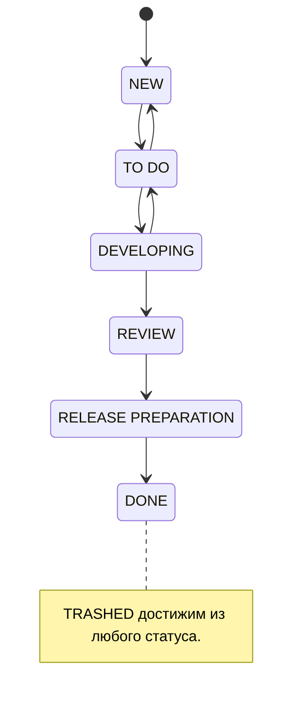

# JIRA Team Workflow (проект DWSAI)

Рабочий процесс JIRA-проекта `DWSAI` и операции с задачами через `dpJira` MCP (Spirit CLI): статусы, переходы и безопасная работа с трекером. Skill про движение и инспекцию существующих задач. Создание и декомпозиция новых задач сюда не входят, см. [Связь с оформлением задач](#связь-с-оформлением-задач).

## Диаграмма workflow



Основной поток: `NEW → TO DO → DEVELOPING → REVIEW → RELEASE PREPARATION → DONE`. Есть обратные переходы и служебный `TRASHED` из любого статуса.

## Статусы

| Статус | Значение | Куда дальше |
|--------|----------|-------------|
| `NEW` | Заведена, не разобрана | `TO DO` после груминга и оценки |
| `TO DO` | Разобрана, готова к работе | `DEVELOPING` при старте; `NEW` при возврате постановки |
| `DEVELOPING` | В работе | `REVIEW` когда открыт MR; `TO DO` при возврате |
| `REVIEW` | На код-ревью | `RELEASE PREPARATION` после approve |
| `RELEASE PREPARATION` | Подготовка к релизу | `DONE` после релиза |
| `DONE` | Завершена | терминальный |
| `TRASHED` | Отменена | терминальный, из любого статуса |

## Правила переходов

- `NEW → TO DO`: задача разобрана, есть оценка, сняты блокеры.
- `TO DO → DEVELOPING`: взяли в работу, задачу ведет один человек.
- `DEVELOPING → REVIEW`: открыт MR, задача связана с ним.
- `REVIEW → RELEASE PREPARATION`: после approve и мержа.
- `RELEASE PREPARATION → DONE`: после релиза.
- Обратные (`DEVELOPING → TO DO`, `TO DO → NEW`): работу нельзя продолжать.
- `* → TRASHED`: задача отменена или неактуальна.

Статус отражает реальное состояние работы.

## Операции через dpJira MCP

Большинство инструментов только читают; перемещение и изменение полей пишут.

| Инструмент | Назначение | Тип |
|------------|------------|-----|
| `dp_jira_issue` | Получить задачу по ключу | read |
| `dp_jira_jql_search` | Поиск по JQL | read |
| `dp_jira_workflow_available` | Доступные сейчас переходы | read |
| `dp_jira_workflow_move` | Выполнить переход | write |
| `dp_jira_workflow_history` | История workflow | read |
| `dp_jira_transitions` | Changelog переходов | read |
| `dp_jira_update`, `dp_jira_editmeta`, `dp_jira_field` | Поля и метаданные | write, read |
| `dp_jira_create` | Создать задачу, лучше через `to-jira-issues` | write |

> `dp_jira_transitions` возвращает историю переходов, а не доступные. Доступные смотри через `dp_jira_workflow_available`.

### Посмотреть задачу

`dp_jira_issue` с `key`. Для экономии контекста: `compact` и `only-fields=key,summary,status,assignee,issuetype`.

### Найти задачи

`dp_jira_jql_search`, например: `project = DWSAI AND status = Developing AND assignee = currentUser()`.

### Перевести в другой статус

ID и имена переходов зависят от проекта и текущего статуса, поэтому порядок такой:

1. `dp_jira_workflow_available` с `key`: получить `ID`, `Name` и целевой статус.
2. `dp_jira_workflow_move` с `key` и одним из `id` или `name`; имя сверяется без учета регистра. Поля перехода, если нужны, передаются повторяемым `field` в формате `field=value`, значение текстом или JSON.

Пример: задача в `DEVELOPING`, перевод на ревью.

```text
dp_jira_workflow_available --key DWSAI-767
#   ID 71  ToDo     -> To Do
#   ID 51  В ревью  -> Review
#   ID 11  Trashed  -> Trashed

dp_jira_workflow_move --key DWSAI-767 --id 51
# или: --name "В ревью"
```

ID выше из конкретного прогона. Перед перемещением всегда сверяй список через `dp_jira_workflow_available`, не хардкодь.

## Safety-правило

- Write-операции (`dp_jira_workflow_move`, `dp_jira_update`, `dp_jira_create`) выполняй только после подтверждения. По умолчанию покажи, что меняешь: ключ, целевой статус, поля, и спроси.
- Перед `dp_jira_workflow_move` всегда вызывай `dp_jira_workflow_available` и бери `id` или `name` оттуда.
- Массовые операции по `jql_search` подтверждай списком задач.

## Связь с оформлением задач

Создание и декомпозиция задач (PRD, RFC, ADR, Epic в тикеты, единый формат) живут в skill `to-jira-issues` и его reference `jira_issue_authoring.md`. Правила оформления здесь не дублируются.
