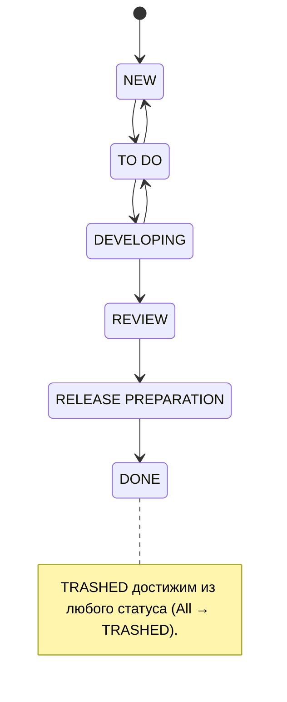

# JIRA Team Workflow (проект DWSAI)

Skill фиксирует рабочий процесс JIRA-проекта `DWSAI` и повторяемые операции с задачами через `dpJira` MCP (Spirit CLI). Назначение — единое понимание статусов/переходов и безопасная работа с трекером из агентских инструментов.

Этот skill — про **движение и инспекцию** существующих задач. Создание и декомпозиция новых задач — отдельный процесс, см. [Связь с оформлением задач](#связь-с-оформлением-задач).

## Диаграмма workflow



Основной поток: `NEW → TO DO → DEVELOPING → REVIEW → RELEASE PREPARATION → DONE`. Есть обратные переходы (вернуть в работу) и служебный `TRASHED` из любого статуса.

## Статусы

| Статус | Значение | Типичный выход |
|--------|----------|----------------|
| `NEW` | Заведена, ещё не разобрана/не оценена | `TO DO` после груминга/оценки |
| `TO DO` | Разобрана, готова к взятию в работу | `DEVELOPING` при старте; `NEW` при возврате постановки |
| `DEVELOPING` | В активной разработке | `REVIEW` когда есть MR на ревью; `TO DO` при возврате |
| `REVIEW` | Изменение на код-ревью | `RELEASE PREPARATION` после одобрения |
| `RELEASE PREPARATION` | Подготовка к релизу | `DONE` после релиза |
| `DONE` | Завершена | терминальный |
| `TRASHED` | Отменена / неактуальна | терминальный; из любого статуса |

## Правила переходов

- **`NEW → TO DO`** — задача разобрана: есть постановка, оценка, сняты блокеры.
- **`TO DO → DEVELOPING`** — берём в работу; статус отражает реальную активность.
- **`DEVELOPING → REVIEW`** — когда открыт MR / изменение готово к ревью; задача связана с MR.
- **`REVIEW → RELEASE PREPARATION`** — после approve и мержа, изменение ждёт релиза.
- **`RELEASE PREPARATION → DONE`** — после фактического релиза.
- **Обратные** (`DEVELOPING → TO DO`, `TO DO → NEW`) — возврат, если работу нельзя продолжать.
- **`* → TRASHED`** — задача отменена/дубликат/неактуальна.

Статус должен отражать реальное состояние работы.

## Операции через dpJira MCP

| Инструмент | Назначение | Тип |
|------------|------------|-----|
| `dp_jira_issue` | Получить задачу по ключу | read |
| `dp_jira_jql_search` | Поиск задач по JQL | read |
| `dp_jira_workflow_available` | **Доступные сейчас** переходы для задачи | read |
| `dp_jira_workflow_move` | **Выполнить** переход (сменить статус) | write |
| `dp_jira_workflow_history` | История workflow | read |
| `dp_jira_transitions` | История (changelog) переходов | read |
| `dp_jira_update` / `dp_jira_editmeta` / `dp_jira_field` | Изменить поля / метаданные | write / read |
| `dp_jira_create` | Создать задачу (предпочтительно через `to-jira-issues`) | write |

> Имя `dp_jira_transitions` обманчиво: это **история** переходов, а не список доступных. Для доступных — `dp_jira_workflow_available`.

### Посмотреть задачу

`dp_jira_issue` с `key`; для экономии контекста — `compact` и `only-fields=key,summary,status,assignee,issuetype`.

### Найти задачи

`dp_jira_jql_search`, напр.: `project = DWSAI AND status = Developing AND assignee = currentUser()`.

### Перевести задачу в другой статус (обязательный порядок)

ID и имена переходов **зависят от проекта и текущего статуса** — не хардкодить:

1. `dp_jira_workflow_available` с `key` → список доступных переходов (`ID`, `Name`, целевой статус).
2. `dp_jira_workflow_move` с `key` и **ровно одним** из `id` или `name` (имя — регистронезависимое точное совпадение). Поля перехода, если нужны workflow, — повторяемым `field` в формате `field=value` (текст или JSON).

**Пример** (задача в `DEVELOPING`, перевод на ревью):

```text
dp_jira_workflow_available --key DWSAI-767
#   ID 71  ToDo     -> To Do
#   ID 51  В ревью  -> Review
#   ID 11  Trashed  -> Trashed

dp_jira_workflow_move --key DWSAI-767 --id 51
# или: dp_jira_workflow_move --key DWSAI-767 --name "В ревью"
```

ID/имена выше — пример; всегда сверяй актуальный список через `dp_jira_workflow_available`.

## Safety-правило

- **Не выполнять write-операции** (`dp_jira_workflow_move`, `dp_jira_update`, `dp_jira_create`) **без явного подтверждения**. По умолчанию — показать, что именно будет сделано (ключ, целевой статус/переход, изменяемые поля), и спросить.
- **Перед `dp_jira_workflow_move` всегда вызывать `dp_jira_workflow_available`** и брать `id`/`name` оттуда.
- При массовых операциях (по `jql_search`) подтверждать список затронутых задач до изменения.

## Связь с оформлением задач

Создание и декомпозиция задач (PRD/RFC/ADR/Epic → тикеты, единый формат заголовка и описания) — это skill **`to-jira-issues`** (и его reference `jira_issue_authoring.md`). Не дублируй правила оформления здесь; этот skill — про движение и инспекцию существующих задач.
