# Minimal PlantUML Example per Diagram Type

One smallest-useful diagram per type. Copy, then replace the names with the domain's own.

## Class

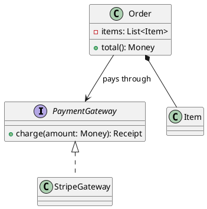

## Sequence

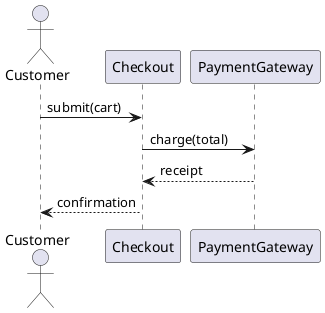

## Activity

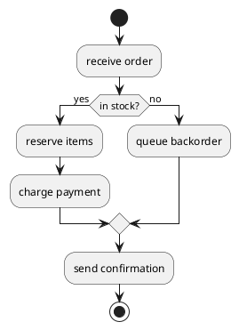

## Swimlane Activity

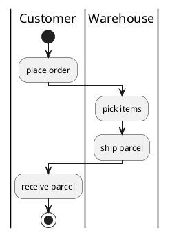

## State Machine

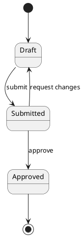

## Component

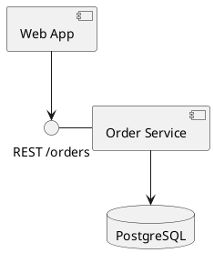

## Use Case

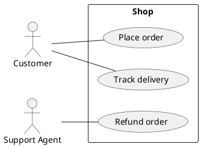

## Deployment

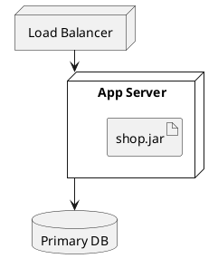

## Object

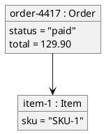

## Package

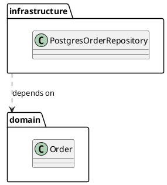

## Communication

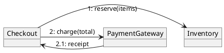

## Composite Structure

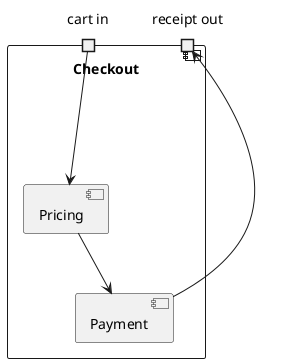

## Interaction Overview

```plantuml
@startuml
start
:authenticate;
group Checkout
  ref over Checkout, PaymentGateway : charge sequence
end group
if (paid?) then (yes)
  :ship order;
else (no)
  :cancel order;
endif
stop
@enduml
```

## Profile

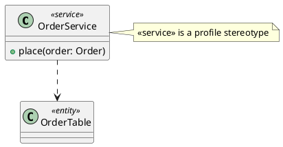
